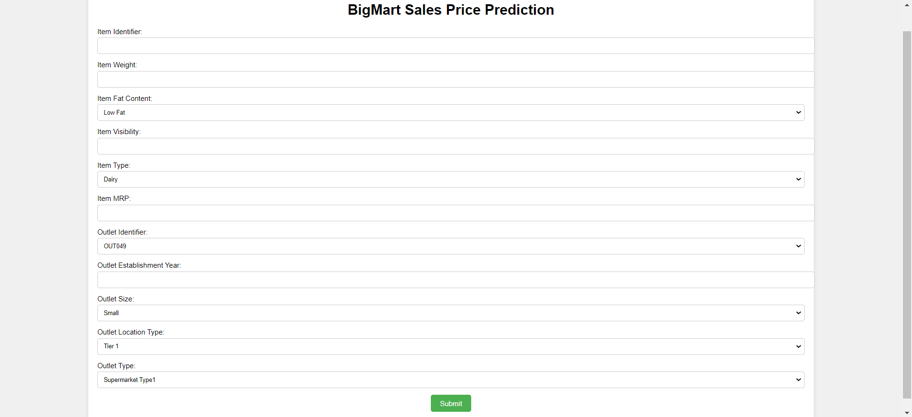

# Sales Store Prediction Project

This repository contains a project focused on predicting item outlet sales in a sales store. The project involves exploratory data analysis (EDA), visualization, feature engineering, feature selection, and model training using the GradientBoostingRegressor algorithm.

## Project Structure

The repository is organized with the following structure:

- `train.csv`: Contains training data with item details and sales information.
- `test.csv`: Contains test data with item details to be used for prediction.
- `notebook.ipynb`: Jupyter notebook containing the project code and analysis.
- `predicted_output.csv`: CSV file containing the predicted item outlet sales with the test data.
- `model.pkl`: Serialized model saved after training using GradientBoostingRegressor.
- `scaler.pkl`: Serialized normalization scaler saved for preprocessing.
- `app.py`: Flask web application to demonstrate the trained model.
- `templates/`: Directory containing HTML templates for the web application.
  - `index.html`: Main page of the web application.
  - `prediction.html`: Page displaying prediction results.

## Data Columns

### Train Data (`train.csv`)

- Item Identifier
- Item Weight
- Item Fat Content
- Item Visibility
- Item Type
- Item MRP
- Outlet Identifier
- Outlet Establishment Year
- Outlet Size
- Outlet Location Type
- Outlet Type
- Item Outlet Sales

### Test Data (`test.csv`)

- Item Identifier
- Item Weight
- Item Fat Content
- Item Visibility
- Item Type
- Item MRP
- Outlet Identifier
- Outlet Establishment Year
- Outlet Size
- Outlet Location Type
- Outlet Type

## Project Execution Steps

1. Perform exploratory data analysis (EDA) on the provided data.
2. Visualize the data to gain insights.
3. Conduct feature engineering and selection to prepare the data for modeling.
4. Train the model using the GradientBoostingRegressor algorithm.
5. Predict item outlet sales for the test data and concatenate the predictions with the test data, saving the result as `predicted_output.csv`.
6. Save the trained model as `model.pkl` and the normalization scaler as `scaler.pkl`.
7. Develop a Flask web application (`app.py`) to demonstrate the trained model.

To run the Flask web application, make sure you have the required dependencies installed as mentioned in `requirements.txt`, and then execute `app.py`.

For any questions or suggestions, please feel free to contact me on LinkedIn.

## Webpage Glimpse:

